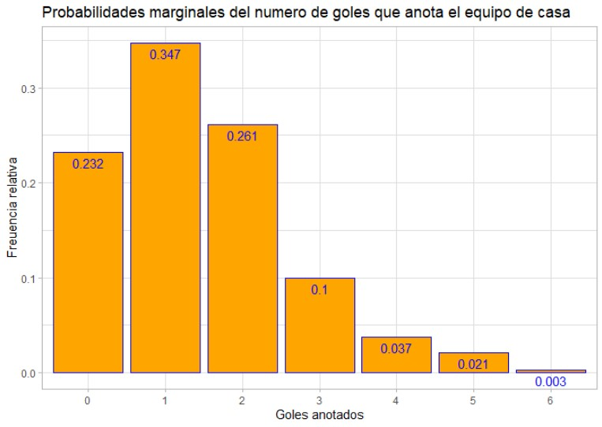

#     POSTWORK - SESIÓN 01
### EQUIPO 6

## INTEGRANTES
- Angélica Luna García
- Jesús Iván Martín Reyes
- Julio Cesar Avila Padilla
- Kimberly Atara Lopez Vazquez
- Manuel Enrique Herrera Flores
- Marco Antonio Hernandez Peñafort


## DESARROLLO
- **Sección 01:** Importa los datos de soccer de la temporada 2019/2020 de la primera división de la liga española a R, los datos los puedes encontrar en el siguiente enlace: https://www.football-data.co.uk/spainm.php
- **Sección 02:** Del data frame que resulta de importar los datos a R, extrae las columnas que contienen los números de goles anotados por los equipos que jugaron en casa (FTHG) y los goles anotados por los equipos que jugaron como visitante (FTAG).
- **Sección 03:** Consulta cómo funciona la función table en R al ejecutar en la consola ```?table```


## PROCEDIMIENTO

```R
# Paso 0 - Cargar las librerías que ocuparemos
suppressMessages(suppressWarnings(library(dplyr))) #Eliminando Warnings


# Paso 1 - Importando los datos de la web a un Data Framework denominado DF.Football
DF.Football <- read.csv("https://www.football-data.co.uk/mmz4281/1920/SP1.csv")

dim(DF.Football) # Se observan: 380 renglones & 105 columnas


# Paso 2 - Extrayendo las columnas FTHG (casa) y FTAG (visitantes)
b <- DF.Football[,c("FTHG", "FTAG" )] # Al Data.Frame llamado "b" asígnale(<-) DF.Football["empty"=todas las filas,de las columnas("FTHG", "FTAG")]

str(b)  # Es meramente para ver la estructura y que nos diga de qué tipo es, en este caso es tipo data.frame

summary(b) #Nos indica las medidas de tendencia central de cada set de datos dentro del nuevo data frame


# Paso 3 - Creando df con  frecuencias absolutas
frec.abs.casa <- as.data.frame(table(FTHG = b$FTHG)) #fa_casa=frec. abs. de equipos que juegan en casa
frec.abs.visit <- as.data.frame(table(FTAG = b$FTAG)) #fa_visit=frec. abs. de equipos que juegan como visitantes


# Paso 4 - Agregando al los df una columna de frecuencias relativas
far_casa <- transform(frec.abs.casa,      #far_casa= frec. abs. y rel. de equipos que juegan en casa
                       fr_casa=round(prop.table(Freq),3))#En lugar de Freq, poner frec.abs.casa$Freq
far_visit <- transform(frec.abs.visit,      #TFAR= tabla de frecuencias absolutas y relativas
                        fr_visit=round(prop.table(Freq),3))

# Paso 5 - Determinando la probabilidad marginal
# Paso 5.1 - De que el equipo que juega en casa anote x goles (x = 0, 1, 2, ...)
c <- length(far_casa$fr_casa) #Calculemos la longitud de la columna de fr_casa

for (i in 0:(c-1)){
  print(paste("La Prob marginal de que el equipo que juega en casa anote", i, "goles es:",
              far_casa[i+1,3]))
}


# Paso 5.2 - De que el equipo que juega como visitante anote y goles (y = 0, 1, 2, ...)
d <- length(far_visit$fr_visit) #longitud de la columna de fr_visit

for (i in 0:(d-1)){
  print(paste("La Prob marginal de que el equipo que juega como visitante anote", i, "goles es:",
              far_visit[i+1,3]))
}

# Paso 6 - Determinar la probabilidad (conjunta) de que el equipo que juega en casa
# anote x goles y el equipo que juega como visitante anote y goles
# (x = 0, 1, 2, ..., y = 0, 1, 2, ...)


# Paso 6.1 - Creando una tabla de frecuencias conjuntas
d <- b %>%
    group_by(FTHG, FTAG) %>%
    summarise(frecuencia = n())

e <- colSums(d[,"frecuencia"]) # e = No. de observaciones = 380

# Paso 6.2 - Añadiendo a la tabla de frecuencias conjuntas, las probabilidades conjuntas
f <- transform(d, pconj=round(d$frecuencia/e, 3))

# Paso 6.3 - Observando los resultados
plot(f)
```
## RESULTADOS
La probabilidad (marginal) de que el equipo que juega en casa anote x goles (x = 0, 1, 2, ...)



La probabilidad (marginal) de que el equipo que juega como visitante anote y goles (y = 0, 1, 2, ...)


La probabilidad (conjunta) de que el equipo que juega en casa anote x goles y el equipo que juega como visitante anote y goles (x = 0, 1, 2, ..., y = 0, 1, 2, ...)


## INTERPRETACIÓN DE LOS RESULTADOS/HALLAZGOS

Con estas primeras probabilidades obtenidas, podemos inferir que estos datos confirman lo que la mayoría de nosotros suponemos al comienzo de un partido de fútbol: 
- Que los equipos de fútbol, en un partido promedio, anotan entre **0 y 2 goles**. 
- **Es raro** (más no imposible) ver un partido donde cualquier equipo meta **más de 3 goles**.
- **La mayoría** de partidos acaba ya sea en **empate**, o con un equipo ganando por **uno o dos goles**.
- **Es raro** (más no imposible), que algún equipo gane por “**goliza**” (con una diferencia de goles mayor o igual a 3).

Un hallazgo novedoso que se puede observar muy bien en el heatmap es que, para los datos analizados, y suponiendo que estos representan fielmente el caso de todos los partidos: **a los equipos que juegan como locales les va mejor que a los que juegan como visitantes**.
