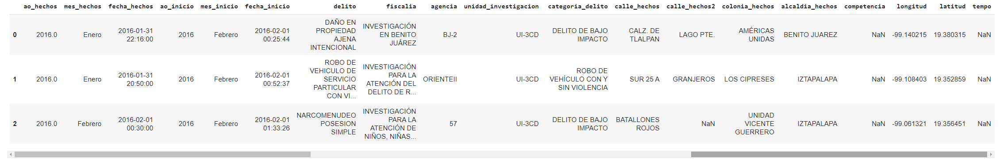
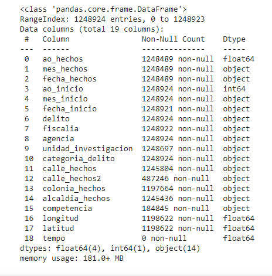
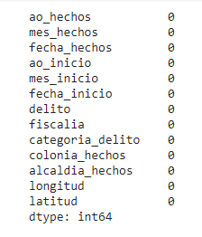
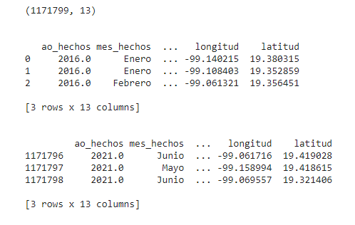
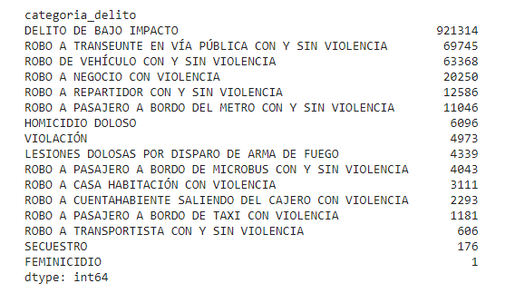
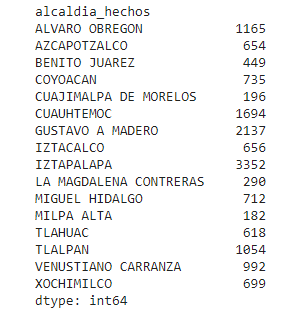
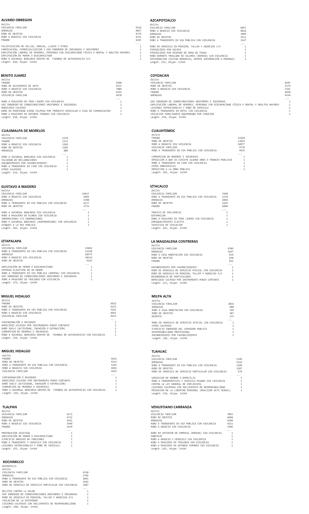
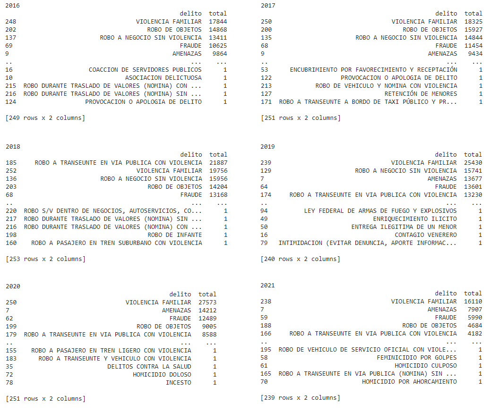
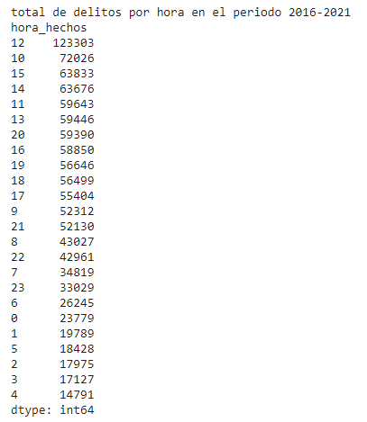

# Equipo 6 😎

Post works de evidencia para la Fase 3 del curso de Data Science de **Bedu**

## Integrantes:
 - Angélica Luna García
 - Jesús Iván Martín Reyes
 - Julio Cesar Avila Padilla
 - Kimberly Atara Lopez Vazquez
 - Manuel Enrique Herrera Flores
 - Marco Antonio Hernandez Peñafort

## Postworks
## **1. Identificación del problema**

### MARCO TEÓRICO
La violencia en nuestro país es un problema grave. Las 6 ciudades más violentas del mundo están en México (EL PAÍS, 2021). Durante el 2018 se cometieron 33 millones de delitos en todo el país, asociados a 24.7 millones de víctimas, lo que significa que uno de cada tres hogares (33.9%) fue objeto de algún ilícito dicho año (INEGI). 

En la CDMX, donde hay más de 9 millones de habitantes (INEGI, 2020), domina la violencia, la inseguridad y, sobre todo, la impunidad. En la Ciudad de México, el 97.7 por ciento de los delitos queda impune. (México Evalúa, 2019).

Estos datos son sumamente alarmantes, pues muestran un claro problema que aqueja a la sociedad y, a pesar de esto, las autoridades no parecen estar atacándolo de la manera correcta. 

“En nuestro país existe una tendencia generalizada a no resolver y/o solucionar los delitos que se conocen, a pesar de que sólo una pequeña parte de los delitos ocurridos llegan al conocimiento de las autoridades.”

Mucho se ha especulado sobre este tema, muchos medios han publicado sus propios datos, y es por ello que nosotros hemos decidido trabajar con la base de datos OFICIAL que publica y actualiza el mismo gobierno capitalino, para poder identificar aquellas colonias y alcaldías en donde se cometen más delitos, observar tendencias, y poder sugerir acciones para atacar aquellas zonas más conflictivas.
### JUSTIFICACIÓN
Se eligió trabajar en este dataset por múltiples razones:
-	Trata un tema de relevancia social, puesto que a todas y todos nos concierne nuestra seguridad y bienestar.
-	Transparencia en los datos: todos los ciudadanos de la Ciudad de México, aquellos de la zona metropolitana que frecuentan dicha ciudad, y otros visitantes ya sean habituales o esporádicos, tienen el derecho a poder consultar dicha información, de una manera sencilla y entendible, por lo que decidimos darnos a la tarea de limpiar y filtrar los datos para en un futuro cercano poder visualizarlos a través de gráficos y mapas que faciliten su interpretación y valoración.
-	Al poder interpretar dicha información, nos podemos hacer cuestionamientos relevantes y forjarnos una opinión acerca de la condición actual de seguridad en la CDMX, que nos permitan exigir a nuestros gobernantes (con base en información fidedigna) que atiendan con mayor eficacia aquellos delitos que se encuentran al alza y focalicen esfuerzos en aquellas delegaciones y colonias donde se muestren tendencias más marcadas de delitos graves.
-	Es un proyecto escalable, puesto que, el análisis que se haga de la CDMX, se puede replicar en otras ciudades del país. El proyecto, además, tiene mucho potencial para posteriormente generar gráficos, mapas y demás figuras visuales que nos permitan interpretar aún más a fondo los datos.

## **2. Planteamiento de preguntas**

A través del análisis de la base de datos elegida, pretendemos dar respuesta a los siguientes cuestionamientos:

- ¿Qué tipos de delitos se cometen con mayor frecuencia?
- ¿En qué colonias y alcaldías se cometen el mayor número de delitos graves?
- ¿Qué tipos de delito han mostrado un crecimiento y decrecimiento en los últimos años? ¿En qué medida?
- ¿Qué tipos de delitos son los que más se cometen por alcaldía?
- ¿Qué delitos han son más comúnes cada año?
- ¿Hay horarios en el día en el que se cometen mayor número de algún tipo de delito?

## 3. **Colección de datos**

La colección de datos se obtuvo del Portal de datos abietos del Gobierno de la Ciudad de México. La colección se llama [*Carpetas de Investigación de la FGJ*](https://archivo.datos.cdmx.gob.mx/fiscalia-general-de-justicia/carpetas-de-investigacion-fgj-de-la-ciudad-de-mexico/carpetas_completa_junio_2021.csv "Carpetas de Investigación de la FGJ"), el cual puedes descargar en formato csv dando clic sobre el nombre. Si deseas descargarlo directamente de la página del Portal de datos abiertos, haz click [*aquí*](https://datos.cdmx.gob.mx/dataset/carpetas-de-investigacion-fgj-de-la-ciudad-de-mexico/resource/48fcb848-220c-4af0-839b-4fd8ac812c0f "aquí").

Esta base de datos contiene la información actualizada de las carpetas de investigación de la Fiscalía General de Justicia (FGJ) de la Ciudad de México a partir de enero de 2016. Las variables que contiene esta base son Carpetas de investigación de delitos a nivel de calle de la FGJ por Fiscalía, Agencia, Unidad de Investigación, fecha de apertura de la carpeta de investigación, delito, categoría de delito, calle, colonia, alcaldía, coordenadas, mes y año. Esta información se actualiza mensualmente.

## **4. Análisis exploratorio de datos**

### 4.1 Convertir el archivo CVS a un DataFrame de pandas
```python
# Realizamos la importación de la librería pandas:
import pandas as pd

# Leemos el archivo csv y consultamos el tipo de archivo generado:
df = pd.read_csv('https://archivo.datos.cdmx.gob.mx/fiscalia-general-de-justicia/carpetas-de-investigacion-fgj-de-la-ciudad-de-mexico/carpetas_completa_junio_2021.csv', sep=',')
type(df)

```
### 4.2 Análisis exploratorio
```python
# Consultamos las dimensiones de nuestro 'df':
df.shape

# Consultamos las primeras 3 entradas del 'df':
df.head(3)

# Consultamos las últimas 3 entradas del 'df':
df.tail(3)

# Revisamos el tipo de datos de cada columna y si contienen NaN's:
df.info()
```




## **5. Limpieza de datos**

Antes de verificar la existencia de NaN eliminamos las columnas que no aportan información reelevante a nuestros objtivos y filtramos los datos a partir del año en que existe mayor número de registros de delitos y contenplando únicamente las alcadías de la CDMX.

### 5.1 Eliminando columnas
```python
# Eliminando 6 columnas que no serán parte del analisis:
df_dropped = df.drop(columns=["unidad_investigacion", "agencia", "tempo", "competencia", "calle_hechos", "calle_hechos2"])
df_dropped.info()
```
### 5.2 Filtrando los datos
```python
# Analizamos a  partir de qué año es pertinente filtrar los datos de acuerdo a la incidencia de delitos:
df_dropped.groupby('ao_hechos')['categoria_delito'].count().tail(20)

# Con base en lo anterior decidimos filtrar los datos a partir del 'ao_hechos'>=2016:
df_filtrado_1=df_dropped.loc[df_dropped['ao_hechos']>=2016]
print(df_filtrado_1.head(3))
print(df_filtrado_1.info())

# Contamos cuántas alcaldías están presentes en el df 'df_filtrado_1':
df_filtrado_1['alcaldia_hechos'].unique()

# Al notar que la columna 'alcaldia_hechos' contiene alcaldías de todo el país, filtramos únicamente aquellas que corresponden a la CDMX
# (16 alcaldías):
alcadias_cdmx = ['BENITO JUAREZ',
  'IZTAPALAPA',
  'CUAUHTEMOC',
  'TLAHUAC',
  'IZTACALCO',
  'GUSTAVO A MADERO',
  'MIGUEL HIDALGO',
  'TLALPAN',
  'ALVARO OBREGON',
  'VENUSTIANO CARRANZA',
  'AZCAPOTZALCO',
  'CUAJIMALPA DE MORELOS',
  'COYOACAN',
  'XOCHIMILCO',
  'LA MAGDALENA CONTRERAS',
  'MILPA ALTA'
 ]

df_filtrado_2 = df_filtrado_1.loc[df_filtrado_1['alcaldia_hechos'].isin(alcadias_cdmx)]
print(df_filtrado_2["alcaldia_hechos"].unique())
print("\n")
print(df_filtrado_2.info())
```
### 5.3 Eliminando los NaN 

```python
# Contamos cuántos NaN existen en cada columna:
df_filtrado_2.isna().sum()

# Ahora eliminamos las filas que contienen puros NaN (si las hay):
df_sin_nan_1=df_filtrado_2.dropna(axis=0, how='all')
df_sin_nan_1

# Al ejecutar la  instrucción anterior no se eliminó ninguna fila, por lo que se asume que ninguna fila contenía puros NaN.

# Ahora eliminamos los registros con NaN en las columnas de fecha_inicio y fiscalia, debido a su poca signficancia estadística:
df_sin_nan_2 = df_sin_nan_1.loc[df_sin_nan_1['fiscalia'].notna()]
df_sin_nan_3 = df_sin_nan_2.loc[df_sin_nan_2['fecha_inicio'].notna()]
df_sin_nan_4 = df_sin_nan_3.loc[df_sin_nan_3["latitud"].notna()]
df_sin_nan_5 = df_sin_nan_4.loc[df_sin_nan_4["longitud"].notna()]

df_sin_nan_5.isna().sum()

# Ahora remplazamos los NaN de la columna 'colonia_hechos' por la palabra Unknown para eliminar completamente los NaN:
df_sin_nan_5["colonia_hechos"] = df_sin_nan_5["colonia_hechos"].fillna('Unknown')
df_sin_nan_5.isna().sum()

# En los casos en los que la latitud y longitud no existe se evaluará posteriormente la posibilidad de colocar la latitud y longitud de la alcadia de
# acuerdo a datos del gobierno de la CDMX: https://datos.cdmx.gob.mx/dataset/bae265a8-d1f6-4614-b399-4184bc93e027/resource/e4a9b05f-c480-45fb-a62c-6d4e39c5180e/download/alcaldias.csv

# lat_long_alcaldias = pd.read_csv("https://datos.cdmx.gob.mx/dataset/bae265a8-d1f6-4614-b399-4184bc93e027/resource/e4a9b05f-c480-45fb-a62c-6d4e39c5180e/download/alcaldias.csv")
```


### 5.4 Reseteando los índices
```python
# Reseteamos los indices, pues hemos eliminado algunas filas:
df_indice_reseteado = df_sin_nan_5.reset_index(drop=True)
print(df_indice_reseteado.shape)
print('\n')
print(df_indice_reseteado.head(3))
print('\n')
print(df_indice_reseteado.tail(3))
```


## 6. Transformación de datos

Aquí transformamos el tipo de dato de cada columna al tipo correcto de acuerdo a su contenido. Posteriormente, se hacen algunos filtros y consultas para responder a las preguntas planteadas. 

### 6.1 Corrigiendo el tipo de datos de las columnas
```python
# Consultamos el tipo de datos que contiene cada columna:
df_indice_reseteado.dtypes

# Hacemos casting del tipo de dato de las columnas. En el caso de las columnas con tipo de dato 'object' se convirtieron a 'str' para evitar 
# tener varios tipos de datos en estas columnas:  
df_indice_reseteado['ao_hechos'] = df_indice_reseteado['ao_hechos'].astype(int)
df_indice_reseteado['mes_hechos'] = df_indice_reseteado['mes_hechos'].astype(str)
df_indice_reseteado['mes_inicio'] = df_indice_reseteado['mes_inicio'].astype(str)
df_indice_reseteado['delito'] = df_indice_reseteado['delito'].astype(str)
df_indice_reseteado['fiscalia'] = df_indice_reseteado['fiscalia'].astype(str)
df_indice_reseteado['categoria_delito'] = df_indice_reseteado['categoria_delito'].astype(str)
df_indice_reseteado['colonia_hechos'] = df_indice_reseteado['colonia_hechos'].astype(str)
df_indice_reseteado['alcaldia_hechos'] = df_indice_reseteado['alcaldia_hechos'].astype(str)

diccionario_de_conversion = {
    'fecha_hechos': 'datetime64[ns]',
    'fecha_inicio': 'datetime64[ns]'
}

df_casting=df_indice_reseteado.astype(diccionario_de_conversion)

print(df_casting.dtypes)
print('\n')
df_casting.head(3)
```


### 6.2 Contestando las preguntas de investigación
#### 6.2.1 *¿Qué tipos de delitos se comete con mayor frecuencia?*
```python
# Hacemos el conteo de la frecuencia de cada categoría de delito y ordenamos de manera ascendente: 
pregunta_1 = df_casting.groupby('categoria_delito').size()
pregunta_1.sort_values(ascending=False)

# Con lo anterior nos dimos cuenta que existe una categoría llamada 'HECHO NO DELICTIVO', así que eliminamos las filas que la contengan, ya que solo nos
# interesan los crimenes. Tabién reseteamos el índice una vez más:
df_casting = df_casting.loc[df_casting['categoria_delito'] != 'HECHO NO DELICTIVO']
df_casting.reset_index(inplace=True)
df_casting.head(3)

# Observamos que apareció una columna nueva 'index', por lo que la eliminamos:
df_casting=df_casting.drop(columns='index')
df_casting

# Y ahora si respondemos a la pregunta 1:
pregunta_1 = df_casting.groupby('categoria_delito').size()
pregunta_1.sort_values(ascending=False)
```


#### 6.2.2 *¿En qué alcaldías se comete el mayor número de delitos graves?*

```python
# Primero consultamos qué delitos existen: 
df_casting['categoria_delito'].unique().tolist()

# Ahora filtramos los delitos que consideramos graves:
delitos_graves = df_casting.loc[df_casting['categoria_delito'].isin(['LESIONES DOLOSAS POR DISPARO DE ARMA DE FUEGO','VIOLACIÓN', 'HOMICIDIO DOLOSO', 'SECUESTRO', 'FEMINICIDIO'])]

# y agrupamos por alcaldía: 
pregunta_2 = delitos_graves.groupby('alcaldia_hechos').size()
pregunta_2
```


#### 6.2.3 *¿Qué tipos de delito han mostrado un crecimiento y decrecimiento en los últimos años?*


1.   Separamos los delitos por año.
2.   Determinamos el número de delitos por año.
3.   Comparamos con una tabla que aplicamos merge de los resultados.

Y determinamos que:

*   La violencia familiar por ejemplo fue en aumento exponencialmente y luego disminuyó en el último año 2021.
*   El robo de objetos ha ido disminuyendo considerablemente en los últimos años.
*   El robo a negocio sin violencia disminuyó en los últimos 2 años.
*   El fraude se mantuvo estable entre 2016-2020 pero disminuyó drásticamente en el último año 2021.
*   Las amenazas fueron en aumento gradualmente, pero disminuyeron considerablemente el último año 2021.

```python
# asignamos las variables df6 y df7, sin embargo, esto no significa que sean parte de una secuencia donde existan DataFrames anteriores (df5, df4, etc.).
df6, df7 = [x for _, x in df_casting.groupby(df_casting['ao_hechos'] == 2021)]
g=df7.groupby('delito')['ao_hechos'].size().reset_index()
res2021=g.sort_values("ao_hechos", ascending=False)
res2021.head()

df6, df7 = [x for _, x in df_casting.groupby(df_casting['ao_hechos'] == 2020)]
g=df7.groupby('delito')['ao_hechos'].size().reset_index()
res2020=g.sort_values("ao_hechos", ascending=False)
res2020.head()

df6, df7 = [x for _, x in df_casting.groupby(df_casting['ao_hechos'] == 2019)]
g=df7.groupby('delito')['ao_hechos'].size().reset_index()
res2019=g.sort_values("ao_hechos", ascending=False)
res2019.head()

df6, df7 = [x for _, x in df_casting.groupby(df_casting['ao_hechos'] == 2018)]
g=df7.groupby('delito')['ao_hechos'].size().reset_index()
res2018=g.sort_values("ao_hechos", ascending=False)
res2018.head()

df6, df7 = [x for _, x in df_casting.groupby(df_casting['ao_hechos'] == 2017)]
g=df7.groupby('delito')['ao_hechos'].size().reset_index()
res2017=g.sort_values("ao_hechos", ascending=False)
res2017.head()

df6, df7 = [x for _, x in df_casting.groupby(df_casting['ao_hechos'] == 2016)]
g=df7.groupby('delito')['ao_hechos'].size().reset_index()
res2016=g.sort_values("ao_hechos", ascending=False)
res2016.head()

data_frames = [res2016, res2017, res2018, res2019, res2020, res2021]
df_resultados = reduce(lambda  left,right: pd.merge(left,right,on=['delito'],
                                            how='outer'), data_frames)
df_resultados.head()
```


#### 6.2.4 *¿Qué tipos de delitos se cometen por alcaldía?*
```python
#Agrupamos delitos por alcaldía de hechos
df_casting.groupby('alcaldia_hechos').size()

#Consultamos cada alcaldía para saber sus tipos de delito que se cometen por la misma
df6, df7 = [x for _, x in df_casting.groupby(df_casting['alcaldia_hechos'] == 'ALVARO OBREGON')]
df7.groupby('delito').size()

df6, df7 = [x for _, x in df_casting.groupby(df_casting['alcaldia_hechos'] == 'AZCAPOTZALCO')]
df7.groupby('delito').size()

df6, df7 = [x for _, x in df_casting.groupby(df_casting['alcaldia_hechos'] == 'BENITO JUAREZ')]
df7.groupby('delito').size()

df6, df7 = [x for _, x in df_casting.groupby(df_casting['alcaldia_hechos'] == 'COYOACAN')]
df7.groupby('delito').size()

df6, df7 = [x for _, x in df_casting.groupby(df_casting['alcaldia_hechos'] == 'CUAJIMALPA DE MORELOS')]
df7.groupby('delito').size()

df6, df7 = [x for _, x in df_casting.groupby(df_casting['alcaldia_hechos'] == 'CUAUHTEMOC')]
df7.groupby('delito').size()

df6, df7 = [x for _, x in df_casting.groupby(df_casting['alcaldia_hechos'] == 'GUSTAVO A MADERO')]
df7.groupby('delito').size()

df6, df7 = [x for _, x in df_casting.groupby(df_casting['alcaldia_hechos'] == 'IZTACALCO')]
df7.groupby('delito').size()

df6, df7 = [x for _, x in df_casting.groupby(df_casting['alcaldia_hechos'] == 'IZTAPALAPA')]
df7.groupby('delito').size()

df6, df7 = [x for _, x in df_casting.groupby(df_casting['alcaldia_hechos'] == 'LA MAGDALENA CONTRERAS')]
df7.groupby('delito').size()

df6, df7 = [x for _, x in df_casting.groupby(df_casting['alcaldia_hechos'] == 'MIGUEL HIDALGO')]
df7.groupby('delito').size()

df6, df7 = [x for _, x in df_casting.groupby(df_casting['alcaldia_hechos'] == 'MILPA ALTA')]
df7.groupby('delito').size()

df6, df7 = [x for _, x in df_casting.groupby(df_casting['alcaldia_hechos'] == 'MIGUEL HIDALGO')]
df7.groupby('delito').size()

df6, df7 = [x for _, x in df_casting.groupby(df_casting['alcaldia_hechos'] == 'TLAHUAC')]
df7.groupby('delito').size()

df6, df7 = [x for _, x in df_casting.groupby(df_casting['alcaldia_hechos'] == 'TLALPAN')]
df7.groupby('delito').size()

df6, df7 = [x for _, x in df_casting.groupby(df_casting['alcaldia_hechos'] == 'VENUSTIANO CARRANZA')]
df7.groupby('delito').size()

df6, df7 = [x for _, x in df_casting.groupby(df_casting['alcaldia_hechos'] == 'XOCHIMILCO')]
df7.groupby('delito').size()
```


#### 6.2.5 *¿Qué delitos son más comúnes cada año?*

*   Violencia familiar
*   Robo de objetos
*   Robo de negocio sin violencia
```python
df6, df7 = [x for _, x in df_casting.groupby(df_casting['ao_hechos'] == 2016)]
g=df7.groupby('delito')['ao_hechos'].size().reset_index()
res=g.sort_values("ao_hechos", ascending=False)
res

df6, df7 = [x for _, x in df_casting.groupby(df_casting['ao_hechos'] == 2017)]
g=df7.groupby('delito')['ao_hechos'].size().reset_index()
res=g.sort_values("ao_hechos", ascending=False)
res

df6, df7 = [x for _, x in df_casting.groupby(df_casting['ao_hechos'] == 2018)]
g=df7.groupby('delito')['ao_hechos'].size().reset_index()
res=g.sort_values("ao_hechos", ascending=False)
res

df6, df7 = [x for _, x in df_casting.groupby(df_casting['ao_hechos'] == 2019)]
g=df7.groupby('delito')['ao_hechos'].size().reset_index()
res=g.sort_values("ao_hechos", ascending=False)
res

df6, df7 = [x for _, x in df_casting.groupby(df_casting['ao_hechos'] == 2020)]
g=df7.groupby('delito')['ao_hechos'].size().reset_index()
res=g.sort_values("ao_hechos", ascending=False)
res

df6, df7 = [x for _, x in df_casting.groupby(df_casting['ao_hechos'] == 2021)]
g=df7.groupby('delito')['ao_hechos'].size().reset_index()
res=g.sort_values("ao_hechos", ascending=False)
res
```


#### 6.2.6 *¿En qué horarios durante el día se cometen mayor número de algún tipo de delito?*
```python
# Primero extraemos la hora de la columna 'fecha_hechos':
horas= pd.DatetimeIndex(df_casting['fecha_hechos']).hour

# Ahora añadimos la columna 'hora_hechos' al dataframe:
df_casting['hora_hechos']=horas
df_casting.tail()

# y hacemos un size para contar el número la frecuencia de delitos por hora (durante el perido 2016-2021). Al parecer, las 12 del día es la hora en la
# que sueden más delitos. 
df_casting.groupby('hora_hechos').size().sort_values(ascending=False)

```
## Descargamos un archivo csv con las columnas necesarias para mapear en el programa que desarrollamos con la API de Google Maps

```python
#Borramos las columnas que no nos servían mucho para mapear y nos concentramos más en la longitud y latitud
df5=df_casting.drop(['mes_hechos',	'fecha_hechos',	'ao_inicio',	'mes_inicio',	'fecha_inicio', 'fiscalia',	'colonia_hechos',	'alcaldia_hechos',	'hora_hechos'], axis = 1)

#Filtramos los delitos del último año
df6, df7 = [x for _, x in df5.groupby(df5['ao_hechos'] == 2021)]
df7

#Agrupamos por delito para obtener el número de delitos por delito del 2021
df7.groupby(['categoria_delito']).size()

#Elegimos violación como ejemplo para mapear
df8, df9 = [x for _, x in df7.groupby(df7['categoria_delito'] == 'VIOLACIÓN')]
df9

#Convertimos el DataFrame a un archivo .csv
df9.to_csv('carpeta_de_invetigacion_FGJ_VIOLACION.csv')

#Finalmente descargamos el archivo
from google.colab import files
files.download("carpeta_de_invetigacion_FGJ_VIOLACION.csv")
```

