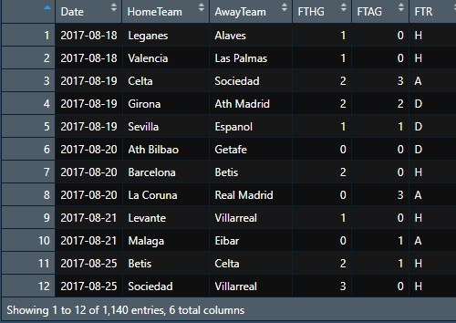

#     POSTWORK - SESIÓN 02
### Equipo 6


## DESARROLLO
- **SECCIÓN 01:** Importa los datos de soccer de las temporadas 2017/2018, 2018/2019 y 2019/2020 de la primera división de la liga española a R, los datos los puedes encontrar en el siguiente enlace: https://www.football-data.co.uk/spainm.php
- **SECCIÓN 02:** Revisa la estructura de de los data frames al usar las funciones: str, head, View y summary.
- **SECCIÓN 03:** Con la función select del paquete dplyr selecciona únicamente las columnas Date, HomeTeam, AwayTeam, FTHG, FTAG y FTR; esto para cada uno de los data frames. (Hint: también puedes usar lapply).
- **SECCIÓN 04:** Asegúrate de que los elementos de las columnas correspondientes de los nuevos data frames sean del mismo tipo (Hint 1: usa as.Date y mutate para arreglar las fechas). Con ayuda de la función rbind forma un único data frame que contenga las seis columnas mencionadas en el punto 3.(Hint 2: la función do.call podría ser utilizada).


## PROCEDIMIENTO

```R
# Paso 0 - Cargar la librería que se usará

library(dplyr)

# Paso 1 - Importanto los datos de las temporadas 2017/2018, 2018/2019 y 2019/2020

Temporada.17_18 <- read.csv("https://www.football-data.co.uk/mmz4281/1718/SP1.csv")
Temporada.18_19 <- read.csv("https://www.football-data.co.uk/mmz4281/1819/SP1.csv")
Temporada.19_20 <- read.csv("https://www.football-data.co.uk/mmz4281/1920/SP1.csv")


# Paso 2 - Revisando la estructura de los df

str(Temporada.17_18); str(Temporada.18_19); str(Temporada.19_20)
head(Temporada.17_18); head(Temporada.18_19); head(Temporada.19_20)
View(Temporada.17_18); View(Temporada.18_19); View(Temporada.19_20)
summary(Temporada.17_18); summary(Temporada.18_19); summary(Temporada.19_20)

# Paso 3 - Seleccionando Date, HomeTeam, AwayTeam, FTHG, FTAG y FTR de cada df

Resumen.17_18 <- select(Temporada.17_18, Date, HomeTeam, AwayTeam, FTHG, FTAG, FTR)
Resumen.18_19 <- select(Temporada.18_19, Date, HomeTeam, AwayTeam, FTHG, FTAG, FTR)
Resumen.19_20 <- select(Temporada.19_20, Date, HomeTeam, AwayTeam, FTHG, FTAG, FTR)

str(Resumen.17_18); str(Resumen.18_19); str(Resumen.19_20)

# Paso 4 - Corrigiendo el formato de las fechas

Resumen.17_18 <- mutate(Resumen.17_18, Date = as.Date(Date,"%d/%m/%y"))
Resumen.18_19 <- mutate(Resumen.18_19, Date = as.Date(Date,"%d/%m/%Y"))
Resumen.19_20 <- mutate(Resumen.19_20, Date = as.Date(Date,"%d/%m/%Y"))

# Paso 4.1 - Usando rbind y do.call para unir los df a1,b1 y c1

lista <- list(Resumen.17_18, Resumen.18_19, Resumen.19_20)
str(lista) #Observando la estructura

datos <- do.call(rbind, lista) #Conglomerando los data frame creados
dim(datos)
summary(datos)

write.csv(datos,"C:\\Users\\black\\Desktop\\Postwork Equipo 6\\Repositorio\\LaLiga2017-2020.csv",row.names = FALSE)

DATA <- read.csv("LaLiga2017-2020.csv")
```

## Resultados

Un solo dataframe unificado con 1140 filas y 6 columnas:



