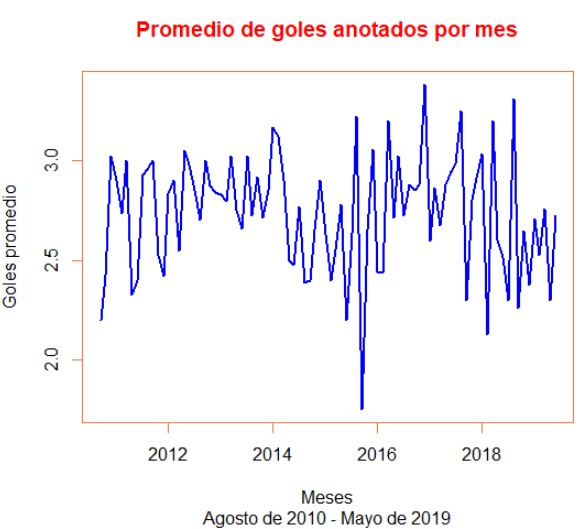
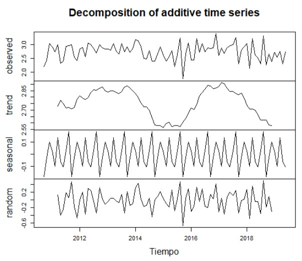

#     POSTWORK - SESIÓN 06
### EQUIPO 6

## DESARROLLO
- **Sección 01:** Importa los datos de soccer de la temporada 2019/2020 de la primera división de la liga española a R, los datos los puedes encontrar en el siguiente enlace: https://www.football-data.co.uk/spainm.php
- **Sección 02:** Del data frame que resulta de importar los datos a R, extrae las columnas que contienen los números de goles anotados por los equipos que jugaron en casa (FTHG) y los goles anotados por los equipos que jugaron como visitante (FTAG).
- **Sección 03:** Consulta cómo funciona la función table en R al ejecutar en la consola ```?table```


## PROCEDIMIENTO

```R
# Paso 0 - cargar las librerías a utilizar e importar los datos
library(dplyr)

datos <- read.csv("https://raw.githubusercontent.com/beduExpert/Programacion-R-Santander-2021/main/Sesion-06/Postwork/match.data.csv")

# Paso 1 - agregar la columna sumagoles con la suma de goles por partido
datos1 <- mutate(datos, sumagoles = datos$home.score + datos$away.score) #se agrega la columna "sumagoles", que es la suma de "home.score" y "away.score"
str(datos1) #nos damos cuenta que la columa date no tiene formato de fecha
datos1 <- mutate(datos1, date=as.Date(date,"%Y-%m-%d")) #le damos el formato adecuado a la columna "date".
str(datos1) #verificamos que todos los datos ya cuentan con la estructura adecuada.

# Paso 2 - obtener promedio por mes de la suma de goles
#install.packages("lubridate")
library(lubridate)                                  #instalar y cargar libería lubridate

datos2 <- datos1                                    # Duplicar los datos
datos2$anio_mes <- floor_date(datos2$date, "month") # Crear columna anio-mes

datos2_aggr <- datos2 %>%                           # Agrupamos por anio_mes y promediamos columna "sumagoles"
  group_by(anio_mes) %>% 
  dplyr::summarize(promgoles = mean(sumagoles)) %>% 
  as.data.frame()

datos2_aggr <- datos2_aggr[-31,] #quitamos la fila 31, porque no es un dato que represente a toda la muestra

datosbien <- mutate(datos2_aggr, anio_mes = format(datos2_aggr$anio_mes, "%Y-%m")) #quitamos el día a las fechas de la columna "date"
head(datosbien)

# Paso 3 - Crear la serie de tiempo  del promedio por mes de la suma de goles hasta mayo de 2019 (fin de la temporada 2018-2019)
datosbien.ts <- ts(datosbien[,2], frequency=10, start=c(2010,8), end=c(2019,5))
datosbien.ts

# Paso 4 - Graficar la serie de tiempo
ts_graph <- plot(datosbien.ts, 
     col ="blue",
     lwd = "2",
     main = "Promedio de goles anotados por mes",
     col.main = "red",
     ylab = "Goles promedio",
     xlab = "Meses",
     sub = "Agosto de 2010 - Mayo de 2019",
     fg = "sienna2")

# PASO ADICIONAL
# Hacer la descomposición de la serie de tiempo para observar sus componentes
desc <- decompose(datosbien.ts)

plot(desc, xlab = "Tiempo", 
     sub = "Descomposición de los datos")
```
## RESULTADOS
Serie de tiempo graficada:



Descomposición de la Serie de tiempo:


## CONSIDERACIONES IMPORTANTES

Para la serie de tiempo, se utilizó una frecuencia igual a 10, puesto que se observó que las temporadas van de agosto a mayo. Por lo anterior, la serie de tiempo se hizo hasta mayo de 2019 y no diciembre de ese mismo año.

## INTERPRETACIÓN DE LOS RESULTADOS/HALLAZGOS

Según los resultados obtenidos, para el periodo analizado de datos, podemos inferir lo siguiente:
- Hay una clara estacionalidad en los datos. Analizando cada ciclo (o temporada), podemos observar que se anotan menos goles a inicio de temporada (agosto) y más goles en los meses octubre-noviembre y a finales de temporada.
- Se observa que las temporadas donde hubo más goles fue la 2012-2013 y la 2016-2017, y donde hubo menos fue la 2015-2016 (esto se ve en la componente “trend” o tendencia).
